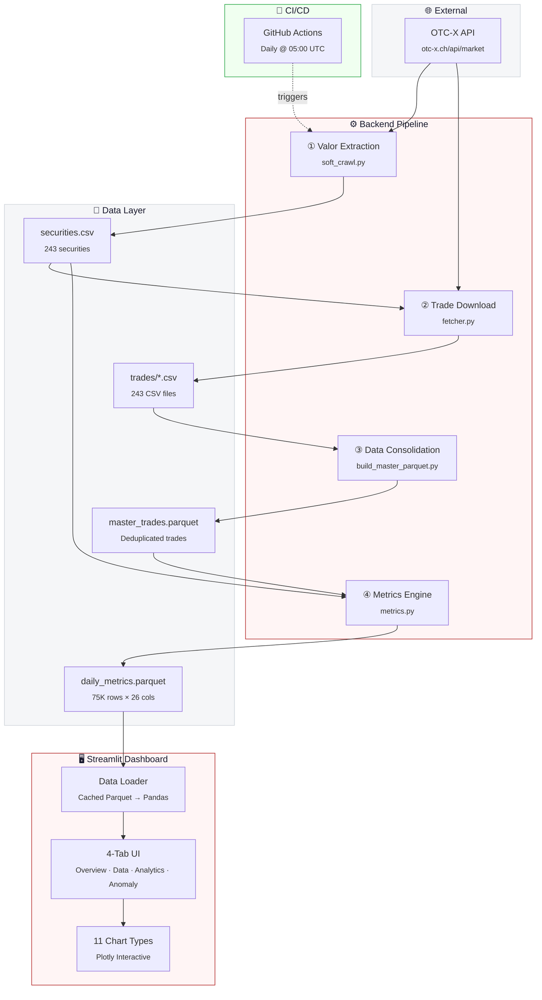
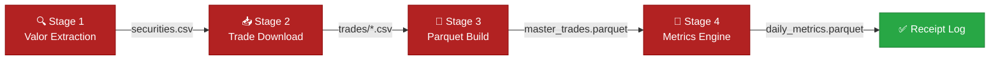

<div align="center">

<!-- ═══════════════════════════════════════════════════════════════
     HERO BANNER — Swiss-inspired OTC-X identity
     ═══════════════════════════════════════════════════════════════ -->

<picture>
  <source media="(prefers-color-scheme: dark)" srcset="https://capsule-render.vercel.app/api?type=waving&color=0:1A1A2E,50:B22222,100:1A1A2E&height=220&section=header&text=OTC%20%7C%20X&fontSize=72&fontColor=FFFFFF&fontAlignY=36&desc=Liquidity%20Radar%20%E2%80%A2%20Swiss%20OTC%20Market%20Intelligence&descSize=18&descAlignY=58&descColor=F5F6F8&animation=fadeIn"/>
  
</picture>

<br/>

<!-- Tagline -->
<samp><b>Turn the opaque Swiss OTC market into a transparent, signal-rich radar.</b></samp>

<br/><br/>

<!-- Status Badges -->
[](https://github.com/atanasovmi/OTC-X/actions/workflows/automation_pipeline.yml)
&nbsp;
[](https://www.python.org/)
&nbsp;
[](https://streamlit.io/)
&nbsp;
[](#license)

<br/>

<!-- Data Stats -->
<table>
<tr>
<td align="center"><b>📈 Securities</b><br/><code>243</code></td>
<td align="center"><b>📊 Daily Metrics</b><br/><code>75,319 rows</code></td>
<td align="center"><b>🏦 Sectors</b><br/><code>10</code></td>
<td align="center"><b>📅 History</b><br/><code>2004 – 2026</code></td>
<td align="center"><b>🔍 Anomaly Tiers</b><br/><code>6 levels</code></td>
</tr>
</table>

</div>

---

<!-- ═══════════════════════════════════════════════════════════════
     🚀 LIVE DASHBOARD — THE HERO CTA
     ═══════════════════════════════════════════════════════════════ -->

<div align="center">

<br/>

<a href="https://otc-x-radar.streamlit.app">

</a>

<br/><br/>

```
  ╔══════════════════════════════════════════════════════════════════╗
  ║                                                                  ║
  ║   🟢  OTC-X Liquidity Radar — Live on Streamlit Cloud           ║
  ║                                                                  ║
  ║   Real-time anomaly detection  •  11 interactive Plotly charts   ║
  ║   243 Swiss OTC securities     •  20+ years of trade history     ║
  ║   Automated daily pipeline     •  Zero manual intervention       ║
  ║                                                                  ║
  ║   ➜  https://otc-x-radar.streamlit.app                          ║
  ║                                                                  ║
  ╚══════════════════════════════════════════════════════════════════╝
```

<sub>The dashboard runs on Streamlit Community Cloud and auto-updates daily at 05:00 UTC via GitHub Actions.</sub>

</div>

<br/>

---

## 📖 Table of Contents

<details open>
<summary><b>Navigate</b></summary>

- [What is OTC-X?](#-what-is-otc-x)
- [Key Features](#-key-features)
- [Dashboard Preview](#-dashboard-preview)
- [Architecture](#-architecture)
- [Data Pipeline](#-data-pipeline)
- [Tech Stack](#-tech-stack)
- [Project Structure](#-project-structure)
- [Getting Started](#-getting-started)
- [How It Works](#-how-it-works)
- [Anomaly Detection](#-anomaly-detection)
- [Contributing](#-contributing)
- [License](#license)

</details>

---

## 🔭 What is OTC-X?

**OTC-X Liquidity Radar** is an end-to-end market intelligence platform for the **Swiss OTC-X exchange** — a marketplace for unlisted Swiss equities covering sectors from banking and real estate to mountain railways and energy.

> **The Problem:** The Swiss OTC market is opaque. Trade data is fragmented, illiquidity metrics are unavailable, and unusual activity goes unnoticed.
>
> **The Solution:** OTC-X Radar automates the entire pipeline — from data collection through anomaly scoring — and surfaces insights through a professional, interactive dashboard.

<div align="center">
<br/>

| From | To |
|:---:|:---:|
| Scattered CSV exports | Unified Parquet data lake |
| Manual spreadsheet analysis | Automated 26-metric engine |
| Invisible market signals | Real-time anomaly alerts |
| Static reports | Interactive 4-tab dashboard |

<br/>
</div>

---

## ✨ Key Features

<table>
<tr>
<td width="50%">

### 📡 Automated Data Pipeline
- **4-stage** ETL pipeline runs daily via GitHub Actions
- Fetches live data from the OTC-X API
- Deduplicates and validates with strict quality checks
- Produces compressed Parquet output with detailed receipt logs

</td>
<td width="50%">

### 🧮 Liquidity Metrics Engine
- **26 metrics** computed per security per trading day
- Rolling 30-day baselines (trading days only)
- Amihud illiquidity ratio (λ) for price-impact analysis
- Spread proxies, log returns, and intraday volatility

</td>
</tr>
<tr>
<td width="50%">

### 🚨 Anomaly Detection
- Weighted scoring: **Volume (3×)**, **Activity (2×)**, **Price Gap (2×)**
- Six severity tiers: Clean → Watch → Alert → Critical → Severe → Extreme
- Context-aware: flags based on 30-day rolling medians
- Clickable risk categories in the dashboard

</td>
<td width="50%">

### 📊 Interactive Dashboard
- **11 Plotly chart types** — from heatmaps to 3D explorers
- 4 tabs: Overview · Market Data · Analytics · Anomaly Monitor
- Swiss-precision design with custom CSS theming
- CSV export, security deep-dives, sector filtering

</td>
</tr>
</table>

---

## 🖥️ Dashboard Preview

<div align="center">

> **4 purpose-built tabs** deliver market intelligence at every level of detail.

| Tab | Description |
|:---|:---|
| **📈 Overview** | KPI cards, 90-day market activity, sector treemap, top movers |
| **🗂️ Market Data** | Full 26-column data explorer with search, sort, and CSV download |
| **📊 Analytics** | Correlation matrix, Amihud boxplots, rolling volatility, 3D scatter |
| **🚨 Anomaly Monitor** | Risk severity cards, anomaly treemap, active alerts table |

</div>

<details>
<summary><b>📊 Chart Gallery (11 chart types)</b></summary>

| # | Chart | Type | Description |
|:---:|:---|:---:|:---|
| 1 | Market Activity | Dual-axis | Volume bars + trade count line (90 days) |
| 2 | Sector Treemap | Treemap | Allocation by volume, colored by avg price change |
| 3 | Top Movers | Bar | Top gainers and losers by price change % |
| 4 | Volume by Sector | Bar | Horizontal bars sorted by total CHF volume |
| 5 | Volume vs Price | Scatter | Log-scale volume × price change, per-sector colors |
| 6 | Amihud by Sector | Box plot | Illiquidity distribution across sectors |
| 7 | Volatility Trend | Line | Rolling volatility with SMA/EWMA smoothing |
| 8 | Correlation Matrix | Heatmap | Lower-triangle metric correlations |
| 9 | Anomaly Treemap | Treemap | Hierarchical severity visualization |
| 10 | Security History | Subplot | Price ± σ band + volume bars for any ISIN |
| 11 | 3D Explorer | 3D Scatter | 5-dimensional interactive visualization |

</details>

---

## 🏗️ Architecture



---

## 🔄 Data Pipeline

The pipeline runs as a single Python module (`python -m backend.pipeline`) and produces a detailed receipt log at each execution.



<details>
<summary><b>Stage Details</b></summary>

| Stage | Module | Input | Output | Description |
|:---:|:---|:---|:---|:---|
| **①** | `soft_crawl.py` | OTC-X API | `securities.csv` | Fetch 243 Swiss securities (Name, Sektor, Valor, ISIN) |
| **②** | `fetcher.py` | API + securities.csv | `trades/*.csv` | Download trade history per ISIN with retry logic & rate limiting |
| **③** | `build_master_parquet.py` | `trades/*.csv` | `master_trades.parquet` | Consolidate, clean, cast types, deduplicate, compress (zstd) |
| **④** | `metrics.py` | `master_trades.parquet` | `daily_metrics.parquet` | Compute 26 daily metrics, rolling baselines, anomaly flags |

**Receipt Log:** Every run produces `backend/logs/pipeline_receipt_YYYY-MM-DD_HHMMSS.log` with:
- Execution timing per stage
- Data product file sizes
- Anomaly snapshot (latest day per ISIN)
- Full stage stdout capture

</details>

---

## 🛠️ Tech Stack

<div align="center">

| Layer | Technology | Purpose |
|:---:|:---:|:---|
|  | **Python 3.10+** | Core runtime |
|  | **Polars** | High-performance DataFrame engine (backend) |
|  | **Pandas** | DataFrame manipulation (frontend) |
|  | **NumPy** | Numerical computation |
|  | **Streamlit** | Interactive web dashboard |
|  | **Plotly** | 11 interactive chart types |
|  | **Apache Parquet** | Columnar data storage (zstd/snappy) |
|  | **GitHub Actions** | Automated daily pipeline (cron) |
|  | **pytest** | 58 unit & integration tests |

</div>

---

## 📁 Project Structure

```
OTC-X/
│
├── 📂 backend/                        # ── Data Pipeline ──────────────────
│   ├── __init__.py
│   ├── pipeline.py                    # 🎯 Main orchestrator (4-stage ETL)
│   ├── 📂 operations/
│   │   ├── soft_crawl.py              # Stage 1: Valor extraction from API
│   │   ├── fetcher.py                 # Stage 2: Trade data download + ISIN validation
│   │   ├── build_master_parquet.py    # Stage 3: CSV → Parquet consolidation
│   │   └── metrics.py                 # Stage 4: 26-metric liquidity engine
│   ├── 📂 data/                       # Pipeline output artifacts
│   │   ├── securities.csv             #   → 243 securities metadata
│   │   ├── securities_enriched.csv    #   → Enriched with computed ISINs
│   │   ├── master_trades.parquet      #   → Deduplicated trade master
│   │   ├── daily_metrics.parquet      #   → 75K rows × 26 metrics
│   │   └── 📂 trades/                 #   → 243 individual trade CSVs
│   └── 📂 logs/                       # Execution receipt logs
│
├── 📂 frontend/                       # ── Streamlit Dashboard ────────────
│   ├── __init__.py
│   ├── app.py                         # 🖥️ Dashboard entry point (4 tabs)
│   └── 📂 operations/
│       ├── config.py                  # Brand constants & palettes
│       ├── styles.py                  # CSS injection (431 lines)
│       ├── utils.py                   # CHF/pct/badge formatters
│       ├── data_loader.py             # Cached Parquet → Pandas loader
│       ├── charts.py                  # 11 Plotly chart builders
│       └── components.py              # Header, KPIs, table renderers
│
├── 📂 tests/                          # ── Test Suite ─────────────────────
│   ├── test_backend.py                # Backend imports, ISIN calc, metrics
│   ├── test_frontend.py               # Formatters, configs, chart smoke tests
│   └── test_paths.py                  # Path resolution & file existence
│
├── 📂 .github/workflows/
│   └── automation_pipeline.yml        # ⏰ Daily pipeline (05:00 UTC cron)
│
├── 📂 .streamlit/
│   └── config.toml                    # Theme: Swiss red (#B22222) on light
│
├── requirements.txt                   # Python dependencies
└── README.md                          # ← You are here
```

---

## 🚀 Getting Started

### Prerequisites

- **Python 3.10+**
- **pip** package manager
- Internet access (for OTC-X API calls during pipeline execution)

### Installation

```bash
# Clone the repository
git clone https://github.com/atanasovmi/OTC-X.git
cd OTC-X

# Install dependencies
pip install -r requirements.txt
```

### Run the Data Pipeline

```bash
# Execute the full 4-stage pipeline
python -m backend.pipeline
```

This will:
1. Fetch securities from the OTC-X API
2. Download trade history for all 243 ISINs
3. Consolidate into a master Parquet file
4. Compute 26 daily metrics with anomaly flags

A receipt log is saved to `backend/logs/pipeline_receipt_*.log`.

### Launch the Dashboard

```bash
# Start the Streamlit dashboard
streamlit run frontend/app.py
```

The dashboard opens at `http://localhost:8501` with 4 interactive tabs.

### Run Tests

```bash
# Run the full test suite (58 tests)
python -m pytest tests/ -v
```

---

## 🧠 How It Works

### Metrics Engine

The engine transforms raw trade records into a 26-column analytical dataset. Each row represents one security on one trading day.

<details>
<summary><b>📐 Core Metrics (click to expand)</b></summary>

| Category | Metric | Formula / Logic |
|:---|:---|:---|
| **Trade Data** | `trades_today` | Count of trades |
| | `volume_today_units` | Σ(volume) |
| | `volume_today_chf` | Σ(price × volume) |
| **Price** | `price_first`, `price_last` | Open / close |
| | `price_min`, `price_max` | Intraday range |
| | `price_change_pct` | (last − first) / first × 100 |
| | `log_returns` | ln(last / first) |
| **Liquidity** | `volatility_daily` | σ(intraday prices) |
| | `amihud_daily` | \|ln(r)\| / V_CHF × 10⁶ |
| | `spread_log_hl` | ln(high / low) |
| | `trade_duration_min` | Max gap between trades (min) |
| | `off_book_pct` | % off-book trades |
| **Baselines** | `*_30d_median` | 30-trading-day rolling medians |

</details>

---

## 🚨 Anomaly Detection

The scoring system flags unusual market activity using a weighted formula against 30-day rolling baselines.

```
Anomaly Score = 3 × volume_spike + 2 × activity_spike + 2 × price_gap
```

| Flag | Trigger | Weight | Logic |
|:---|:---|:---:|:---|
| **Volume Spike** | Volume > 1.5× median | **3** | Captures unusual CHF flow |
| **Activity Spike** | Trades > 1.5× median | **2** | Detects unusual trade frequency |
| **Price Gap** | \|ΔP\| > 5% | **2** | Flags abnormal price movement |

### Severity Tiers

<div align="center">

| Score | Tier | Color |
|:---:|:---|:---:|
| **0** | 🟢 Clean | `#28A745` |
| **1** | 🟡 Watch | `#FFC107` |
| **2** | 🟠 Alert | `#FD7E14` |
| **3–4** | 🔴 Critical | `#DC3545` |
| **5–6** | 🟥 Severe | `#7D1128` |
| **7** | ⬛ Extreme | `#4A0010` |

</div>

---

## 🤝 Contributing

Contributions are welcome! Here's how to get started:

1. **Fork** the repository
2. **Create** a feature branch (`git checkout -b feature/my-feature`)
3. **Run** the test suite to ensure nothing breaks:
   ```bash
   python -m pytest tests/ -v
   ```
4. **Commit** your changes (`git commit -m 'Add my feature'`)
5. **Push** to the branch (`git push origin feature/my-feature`)
6. **Open** a Pull Request

### Development Guidelines

- Follow existing code conventions (type hints, docstrings, PEP 8)
- Backend uses **Polars** for high-performance data processing
- Frontend uses **Pandas** for Streamlit/Plotly compatibility
- All paths use `Path(__file__).resolve().parent` chains — no hardcoded paths
- Swiss number formatting: thousands separator is `'` (apostrophe), currency is CHF

---

## License

This project is private and proprietary. All rights reserved.

---

<div align="center">

<br/>

<sub>Built with precision 🇨🇭 for the Swiss OTC market</sub>

<br/>

<a href="https://otc-x-radar.streamlit.app">

</a>

<br/><br/>


</div>
