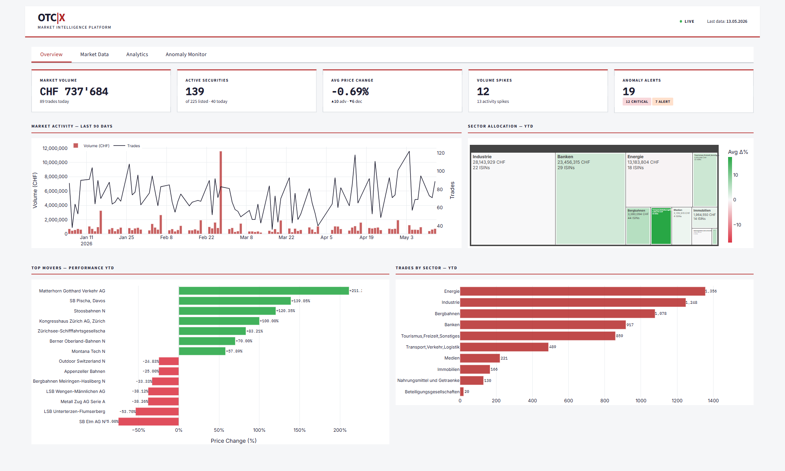
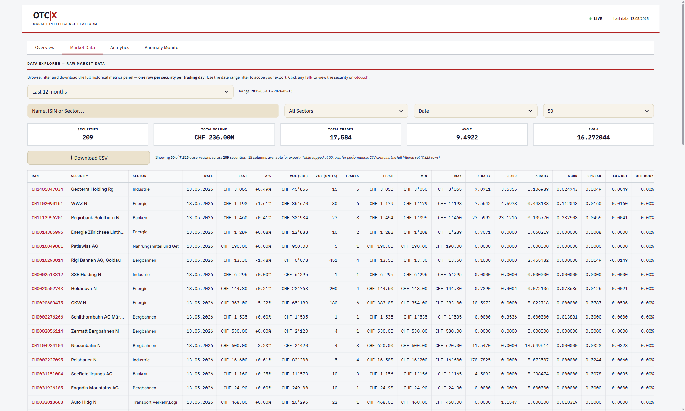
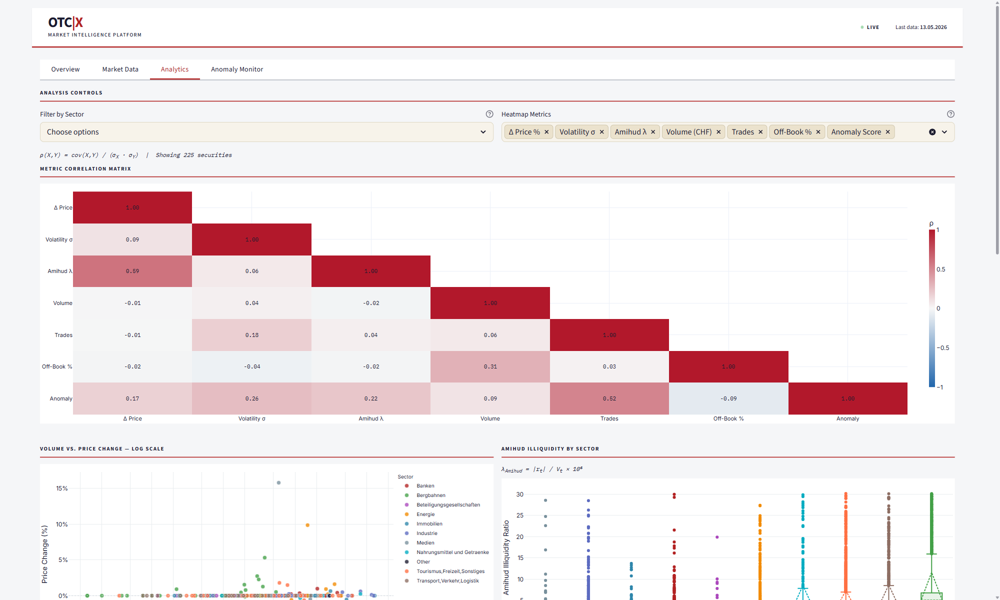
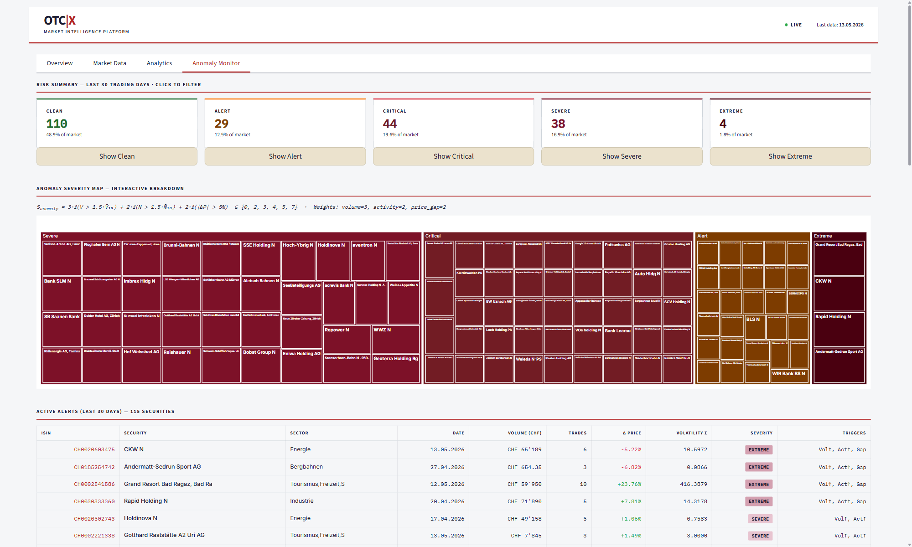
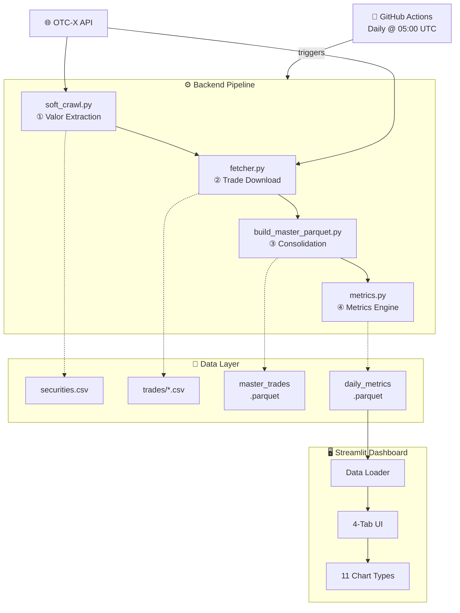

<div align="center">

<!-- ═══════════════════════════════════════════════════════════════
     HERO BANNER — Swiss-inspired OTC-X identity
     ═══════════════════════════════════════════════════════════════ -->

<picture>
  <source media="(prefers-color-scheme: dark)" srcset="https://capsule-render.vercel.app/api?type=waving&color=0:1A1A2E%2C15:B22222%2C85:B22222%2C100:1A1A2E&height=220&section=header&text=OTC%20%7C%20X&fontSize=72&fontColor=FFFFFF&fontAlignY=36&desc=Liquidity%20Radar%20%E2%80%A2%20Swiss%20OTC%20Market%20Intelligence&descSize=18&descAlignY=58&descColor=F5F6F8&animation=twinkling"/>
  
</picture>

<br/>

<!-- Tagline -->
<samp><b>Turn the opaque Swiss OTC market into a transparent, signal-rich radar.</b></samp>

<br/><br/>

<!-- Status Badges -->
<p>
  <a href="LICENSE.md"></a>
  
  <a href="https://github.com/atanasovmi/OTC-X/actions/workflows/automation_pipeline.yml"></a>
  <a href="https://docs.pytest.org"></a>
  <a href="https://otc-x-radar.streamlit.app"></a>
</p>

<br/>

<!-- ═══════════════════════════════════════════════════════════════
     LIVE DASHBOARD — ELEGANT CTA
     ═══════════════════════════════════════════════════════════════ -->

<a href="https://otc-x-radar.streamlit.app">
  
</a>

<br/><br/>

<sub><b>6,032</b> LOC Python · <b>115+</b> tests · <b>26</b> metrics per security per day · <b>224</b> securities · <b>22 years</b> of history</sub>

</div>

<br/>

<br/>

---

<br/>

## 📖 Table of Contents

<details open>
<summary><b>Navigate</b></summary>

- [What is OTC-X?](#-what-is-otc-x)
- [Tech Stack](#-tech-stack)
- [Key Features](#-key-features)
- [Dashboard Preview](#-dashboard-preview)
- [Architecture](#-architecture)
- [Data Pipeline](#-data-pipeline)
- [Project Structure](#-project-structure)
- [Getting Started](#-getting-started)
- [Documentation Toolchain](#-documentation-toolchain)
- [Metrics Engine](#-metrics-engine)
- [Feedback & Ideas](#-feedback--ideas)
- [Proprietary Notice & Terms of Use](#-proprietary-notice--terms-of-use)

</details>

<br/>

---

<br/>

## 🔭 What is OTC-X?

<table>
<tr>
<td width="50%">

### 🎯 Problem
The Swiss OTC market is **opaque**: fragmented data sources, no standardized liquidity metrics, and invisible trading signals make informed decision-making nearly impossible for institutional investors.

</td>
<td width="50%">

### 👥 Zielgruppe (Target Audience)
**BEKB Trading Desk** and institutional stakeholders of the OTC-X platform — the teams who need real-time market intelligence across **243 Swiss unlisted equities**.

</td>
</tr>
<tr>
<td width="50%">

### 💡 Lösung (Solution)
A fully automated **end-to-end data pipeline**: from raw OTC-X API data through 4-stage ETL processing, 26-metric computation, and anomaly detection — to an interactive Streamlit dashboard with **11 chart types**.

</td>
<td width="50%">

### ⭐ Wert & Einzigartigkeit (Value & Uniqueness)
The **only live liquidity radar** for Swiss OTC equities: automated anomaly scoring, rolling 30-day risk baselines, and institutional-grade analytics — **zero manual intervention**, refreshed daily via GitHub Actions.

</td>
</tr>
</table>

<br/>

---

<br/>

## 🛠️ Tech Stack

<div align="center">

<table>
<tr>
<th>Layer</th>
<th>Technology</th>
<th>Role</th>
</tr>
<tr>
<td><b>Core</b></td>
<td><a href="https://python.org"></a></td>
<td>Runtime environment</td>
</tr>
<tr>
<td><b>ETL</b></td>
<td><a href="https://pola.rs"></a>  <a href="https://rust-lang.org"></a>  <a href="https://docs.python-requests.org"></a></td>
<td>Rust-based high-performance DataFrame engine & API ingestion</td>
</tr>
<tr>
<td><b>Analytics</b></td>
<td><a href="https://pandas.pydata.org"></a>  <a href="https://numpy.org"></a></td>
<td>Data manipulation & numerics</td>
</tr>
<tr>
<td><b>Dashboard</b></td>
<td><a href="https://streamlit.io"></a>  <a href="https://plotly.com/python/"></a><br/><br/><a href="https://developer.mozilla.org/en-US/docs/Web/CSS"></a>  <a href="https://developer.mozilla.org/en-US/docs/Web/HTML"></a></td>
<td>Interactive web UI with 448-line Swiss-design CSS & 11 chart types</td>
</tr>
<tr>
<td><b>Storage</b></td>
<td><a href="https://parquet.apache.org"></a>  <a href="https://arrow.apache.org/docs/python/"></a></td>
<td>Columnar data serialization (Zstandard compression)</td>
</tr>
<tr>
<td><b>CI / CD</b></td>
<td><a href="https://github.com/features/actions"></a></td>
<td>Automated daily pipeline (cron @ 05:00 UTC)</td>
</tr>
<tr>
<td><b>Testing</b></td>
<td><a href="https://docs.pytest.org"></a>  <a href="https://pytest-bdd.readthedocs.io"></a></td>
<td>Unit, integration, system & BDD acceptance tests</td>
</tr>
<tr>
<td><b>Docs</b></td>
<td><a href="https://www.latex-project.org"></a>  <a href="https://miktex.org"></a>  <a href="https://strawberryperl.com"></a></td>
<td>53-page IREB requirements catalogue (PDF compilation)</td>
</tr>
</table>

</div>

<br/>

---

<br/>

## ✨ Key Features

<table>
<tr>
<td width="50%">

### 📡 Automated Data Pipeline
- **4-stage** ETL pipeline runs daily via GitHub Actions
- Fetches live data from the OTC-X API
- Deduplicates and validates with strict quality checks
- Produces compressed Parquet output with detailed receipt logs

</td>
<td width="50%">

### 🧮 Liquidity Metrics Engine
- **26 metrics** computed per security per trading day
- Rolling 30-day baselines (trading days only)
- Amihud illiquidity ratio (λ) for price-impact analysis
- Spread proxies, log returns, and intraday volatility

</td>
</tr>
<tr>
<td width="50%">

### 🚨 Anomaly Detection
- Weighted scoring: **Volume (3×)**, **Activity (2×)**, **Price Gap (2×)**
- Five severity tiers: Clean → Alert → Critical → Severe → Extreme
- Context-aware: flags based on 30-day rolling medians
- Clickable risk categories in the dashboard

</td>
<td width="50%">

### 📊 Interactive Dashboard
- **11 Plotly chart types** — from heatmaps to 3D explorers
- 4 tabs: Overview · Market Data · Analytics · Anomaly Monitor
- Swiss-precision design with custom CSS theming
- CSV export, security deep-dives, sector filtering

</td>
</tr>
</table>

<br/>

---

<br/>

## 🖥️ Dashboard Preview

> **4 purpose-built tabs** deliver market intelligence at every level of detail.

### 📈 Overview
KPI cards · 90-day market activity · Sector treemap · Top movers

<!-- Replace the URL below with your own screenshot -->
<div align="center">

</div>

### 🗂️ Market Data
Full 26-column data explorer · Search & sort · CSV download · Security deep-dive

<div align="center">

</div>

### 📊 Analytics
Correlation matrix · Amihud boxplots · Rolling volatility · 3D market explorer

<div align="center">

</div>

### 🚨 Anomaly Monitor
Risk severity cards · Anomaly treemap · Active alerts table

<div align="center">

</div>

<details>
<summary><b>📊 Chart Gallery (11 chart types)</b></summary>

| # | Chart | Type | Description |
|:---:|:---|:---:|:---|
| 1 | Market Activity | Dual-axis | Volume bars + trade count line (90 days) |
| 2 | Sector Treemap | Treemap | YTD allocation by volume, colored by avg YTD return |
| 3 | Top Movers | Bar | Top gainers and losers by YTD performance |
| 4 | Trades by Sector | Bar | Horizontal bars sorted by YTD trade count |
| 5 | Volume vs Price | Scatter | Log-scale volume × price change, per-sector colors |
| 6 | Amihud by Sector | Box plot | Illiquidity distribution across sectors |
| 7 | Volatility Trend | Line | Rolling volatility with SMA/EWMA smoothing |
| 8 | Correlation Matrix | Heatmap | Lower-triangle metric correlations |
| 9 | Anomaly Treemap | Treemap | Hierarchical severity visualization |
| 10 | Security History | Subplot | Price ± σ band + volume bars for any ISIN |
| 11 | 3D Explorer | 3D Scatter | 5-dimensional interactive visualization |

</details>

<br/>

---

<br/>

## 🏗️ Architecture



<br/>

---

<br/>

## 🔄 Data Pipeline

<div align="center">

<code>OTC-X API</code>&ensp;⟶&ensp;<code>Discovery</code>&ensp;⟶&ensp;<code>Collection</code>&ensp;⟶&ensp;<code>Consolidation</code>&ensp;⟶&ensp;<code>Intelligence</code>&ensp;⟶&ensp;<code>Dashboard</code>

<br/>

<sub>Orchestrated by <a href="backend/pipeline.py"><code>pipeline.py</code></a> · Automated daily @ 05:00 UTC via GitHub Actions</sub>

</div>

<br/>

| Stage | Module | What happens | Output |
|:---:|:---|:---|:---|
| **①** | [`soft_crawl.py`](backend/operations/soft_crawl.py) | Discovers 243 securities from the OTC-X API (ISIN, Valor, Sektor) | `securities.csv` |
| **②** | [`fetcher.py`](backend/operations/fetcher.py) | Downloads per-ISIN trade history with retry logic & rate limiting | `trades/*.csv` |
| **③** | [`build_master_parquet.py`](backend/operations/build_master_parquet.py) | Deduplicates, type-casts, compresses into columnar storage (Zstandard) | `master_trades.parquet` |
| **④** | [`metrics.py`](backend/operations/metrics.py) | Computes 26 daily metrics, 30-day rolling baselines, anomaly flags | `daily_metrics.parquet` |

<br/>

---

<br/>

## 📁 Project Structure

```
OTC-X/
│
├── 📂 backend/                        # ── Data Pipeline ──────────────────
│   ├── __init__.py
│   ├── pipeline.py                    # 🎯 Main orchestrator (4-stage ETL)
│   ├── 📂 operations/
│   │   ├── soft_crawl.py              # Stage 1: Valor extraction from API
│   │   ├── fetcher.py                 # Stage 2: Trade data download + ISIN validation
│   │   ├── build_master_parquet.py    # Stage 3: CSV → Parquet consolidation
│   │   └── metrics.py                 # Stage 4: 26-metric liquidity engine (469 LOC)
│   ├── 📂 data/                       # Pipeline output artifacts
│   │   ├── securities.csv             #   → 243 securities metadata
│   │   ├── master_trades.parquet      #   → Deduplicated trade master
│   │   ├── daily_metrics.parquet      #   → 76K+ rows × 26 metrics
│   │   └── 📂 trades/                 #   → 243 individual trade CSVs
│   └── 📂 logs/                       # Execution receipt logs
│
├── 📂 frontend/                       # ── Streamlit Dashboard ────────────
│   ├── __init__.py
│   ├── app.py                         # 🖥️ Dashboard entry point (4 tabs)
│   └── 📂 operations/
│       ├── config.py                  # Brand constants & palettes
│       ├── styles.py                  # Swiss-design CSS injection (448 LOC)
│       ├── utils.py                   # CHF/pct/badge formatters
│       ├── data_loader.py             # Cached Parquet → Pandas loader
│       ├── charts.py                  # 11 Plotly chart builders (945 LOC)
│       └── components.py              # Header, KPIs, table renderers
│
├── 📂 tests/                          # ── Test Suite ─────────────────────
│   ├── test_backend.py                # Backend imports, ISIN calc, metrics
│   ├── test_frontend.py               # Formatters, configs, chart smoke tests
│   ├── test_paths.py                  # Path resolution & file existence
│   ├── test_integration.py            # Cross-module integration tests
│   ├── test_system.py                 # End-to-end system & edge-case tests
│   ├── test_acceptance.py             # BDD step definitions (pytest-bdd)
│   └── 📂 features/                   # Gherkin feature files
│       ├── anomaly_detection.feature  #   → Severity scoring scenarios
│       ├── dashboard_loading.feature  #   → UI load & tab navigation
│       ├── data_pipeline.feature      #   → ETL stage validation
│       └── formatting.feature         #   → CHF/number display rules
│
├── 📂 docs/                           # ── Documentation ──────────────────
│   ├── OTC_X_Anforderungskatalog_Final.tex   # IREB requirements catalogue (LaTeX)
│   ├── OTC_X_Anforderungskatalog_Final.pdf   # Compiled 53-page PDF
│   └── 📂 screenshots/               # Dashboard tab captures
│       ├── tab1-overview.png
│       ├── tab2-market-data.png
│       ├── tab3-analytics.png
│       └── tab4-anomaly-monitor.png
│
├── 📂 .github/
│   ├── 📂 workflows/
│   │   └── automation_pipeline.yml    # ⏰ Daily pipeline (05:00 UTC cron)
│   └── 📂 agents/
│       └── my-agent.agent.md          # GitHub Copilot agent config
│
├── 📂 .streamlit/
│   └── config.toml                    # Theme: Swiss red (#B22222) on light
│
├── requirements.txt                   # Python dependencies
├── LICENSE.md                         # Proprietary terms (EN/DE/FR/IT)
├── SECURITY.md                        # Security policy & vulnerability reporting
└── README.md                          # ← You are here
```

<br/>

---

<br/>

## 🚀 Getting Started

> **Note:** This repository is proprietary software developed for the BEKB Trading Desk.
> Local execution is restricted to authorized personnel only — see [Proprietary Notice](#-proprietary-notice--terms-of-use).

### For BEKB Authorized Personnel

**Prerequisites:** Python 3.10+ · pip

```bash
# 1 — Install dependencies
pip install -r requirements.txt

# 2 — Run the 4-stage data pipeline
python -m backend.pipeline

# 3 — Launch the Streamlit dashboard
streamlit run frontend/app.py

# 4 — Run the test suite
python -m pytest tests/ -v
```

### For Everyone Else

The live dashboard is publicly available — no installation required:

<div align="center">

<a href="https://otc-x-radar.streamlit.app">
  
</a>

</div>

<br/>

---

<br/>

## 📄 Documentation Toolchain

The `docs/` directory contains a **53-page IREB-compliant Requirements Engineering catalogue** written in LaTeX. To compile the PDF locally, the following toolchain is required:

### Prerequisites

| Tool | Purpose | Download |
|:---|:---|:---|
| **MiKTeX** | LaTeX distribution (pdflatex, makeglossaries, latexmk) | [miktex.org](https://miktex.org/download) |
| **Strawberry Perl** | Required by `latexmk` and `makeglossaries` on Windows | [strawberryperl.com](https://strawberryperl.com) |

> **Installation order matters:** Install Strawberry Perl **first**, then MiKTeX. MiKTeX's `latexmk` depends on a Perl interpreter being available on `PATH`.

### Compile the PDF

```bash
# One-liner: compile + clean auxiliary files
latexmk -pdf OTC_X_Anforderungskatalog_Final.tex && latexmk -c && del *.acn *.acr *.alg *.glo *.glg *.gls *.ist *.aux *.log *.toc *.lof *.lot *.out *.fls *.fdb_latexmk
```

<details>
<summary><b>What this does (step by step)</b></summary>

| Command | Effect |
|:---|:---|
| `latexmk -pdf` | Runs `pdflatex` → `makeglossaries` → `pdflatex` (×2) automatically, resolving all cross-references, glossary entries, and table of contents in the correct order |
| `latexmk -c` | Removes standard auxiliary files (`.aux`, `.log`, `.fls`, etc.) |
| `del *.acn ...` | Removes glossary and index intermediaries that `latexmk -c` does not cover |

The compiled PDF is written to `docs/OTC_X_Anforderungskatalog_Final.pdf`.

</details>

<br/>

---

<br/>

## 📐 Metrics Engine

The engine transforms raw trade records into a **26-column** analytical dataset. Each row = one security × one trading day.

### Price Dynamics

$$\text{price change pct} = \frac{P_{\text{last}} - P_{\text{first}}}{P_{\text{first}}} \times 100$$

$$r_{\log} = \ln\!\left(\frac{P_{\text{last}}}{P_{\text{first}}}\right)$$

### Intraday Volatility

$$\sigma_{\text{daily}} = \sqrt{\frac{1}{n-1}\sum_{i=1}^{n}\left(P_i - \bar{P}\right)^2}$$

### Amihud Illiquidity Ratio

$$\lambda_{\text{Amihud}} = \frac{|r_{\log}|}{V_{\text{CHF}}} \times 10^{6}$$

> A higher λ indicates greater price impact per unit of volume — the hallmark of an illiquid security.

### Spread Proxy (Corwin–Schultz)

$$S_{\text{HL}} = \ln\!\left(\frac{P_{\text{high}}}{P_{\text{low}}}\right)$$

### Rolling Baselines

$$\tilde{x}_{30} = \text{median}\!\left(x_{t-29},\; x_{t-28},\; \ldots,\; x_{t}\right)$$

Computed over **30 trading days** (not calendar days) per ISIN for: trades, volume, volatility, and Amihud.

### Anomaly Scoring

$$\text{Score} = 3 \cdot \mathbf{1}_{\text{vol}} + 2 \cdot \mathbf{1}_{\text{act}} + 2 \cdot \mathbf{1}_{\text{price}}$$

| Flag | Trigger | Weight |
|:---|:---|:---:|
| Volume Spike | $V > 1.5 \times \tilde{V}_{30}$ | **3** |
| Activity Spike | $N_{\text{trades}} > 1.5 \times \tilde{N}_{30}$ | **2** |
| Price Gap | $\lvert\Delta P\%\rvert > 5$ | **2** |

<br/>

---

<br/>

## 💡 Feedback & Ideas

This project is proprietary, but feedback is welcome.

If you have suggestions for improving analytics, visualization, or the pipeline:

1. **Open an [Issue](https://github.com/atanasovmi/OTC-X/issues)** — describe your idea, feature request, or bug report
2. The author will evaluate and may integrate contributions with proper attribution

> **Pull Requests** are reviewed on a case-by-case basis. All contributions become subject to the project's proprietary terms upon merging.

### Development Conventions

- Type hints + NumPy-style docstrings on all functions
- Backend: **Polars** · Frontend: **Pandas**
- Paths via `Path(__file__).resolve().parent` chains — no hardcoded paths
- Swiss number formatting: `'` thousands separator, CHF currency

<br/>

---

<br/>

## ⚖️ Proprietary Notice & Terms of Use

<details>
<summary><b>🇬🇧 English</b></summary>

### Data Sovereignty and Project Restraints

**Art. 1 — Subject Matter and Ownership**

All content contained within this repository—including but not limited to source code, algorithms, data structures, and user interface logic—is the exclusive intellectual property of the author.

This project is developed specifically and exclusively for the **BEKB (Berner Kantonalbank AG) Trading Desk**, the entity responsible for the OTC-X platform, and its authorized internal stakeholders.

The transfer of any rights or deliverables is intended solely for the Berner Kantonalbank AG upon project completion.

**Art. 2 — Data Sovereignty and Processing Authorization**

The author maintains the singular right to process and retrieve data from the Berner Börse (OTC-X).

This explicit authorization was granted per request by:

> **Berner Kantonalbank AG**
> Schwarzenburgstrasse 160
> Postfach
> 3001 Bern

This authorization is strictly limited as follows:

*lit. a:* it applies only to this specific use case and project;
*lit. b:* it is granted solely for the duration of this development phase;
*lit. c:* it is contingent upon the final delivery of the project to the BEKB.

Data sovereignty remains with the author until the formal handover to the BEKB. No third party is authorized to claim, replicate, or intercept the data streams processed herein.

**Art. 3 — Usage Restraints and Prohibitions**

Unauthorized use by any third party is strictly prohibited. This includes, but is not limited to:

**Local Execution:** Cloning, compiling, or executing this code locally is restricted to authorized BEKB personnel only.

**Data Extraction Restraints (Anti-Scraping):**

*lit. a:* The automated or manual retrieval of data from this project for storage outside the BEKB infrastructure is prohibited.
*lit. b:* Utilizing the logic within this repository to bypass security or access protocols of the OTC-X website is not permitted.

**Prohibition of Impersonation:** The use of this code to mimic, mirror, or falsely represent the services of BEKB or OTC-X (impersonation) is strictly forbidden.

**Art. 4 — Final Provisions**

This software is provided "as is," intended for the internal business purposes of the BEKB Trading Desk.

Any access to this repository does not constitute a grant of license for public or commercial distribution.

</details>

<details>
<summary><b>🇩🇪 Deutsch</b></summary>

### Datensouveränität und Projektbeschränkungen

**Art. 1 — Gegenstand und Eigentum**

Sämtliche Inhalte dieses Repositorys — einschliesslich, aber nicht beschränkt auf Quellcode, Algorithmen, Datenstrukturen und Benutzeroberflächenlogik — sind ausschliessliches geistiges Eigentum des Autors.

Dieses Projekt wurde spezifisch und ausschliesslich für den **BEKB (Berner Kantonalbank AG) Trading Desk** entwickelt, die für die OTC-X-Plattform verantwortliche Stelle, sowie deren autorisierte interne Stakeholder.

Die Übertragung jeglicher Rechte oder Ergebnisse ist ausschliesslich für die Berner Kantonalbank AG nach Projektabschluss vorgesehen.

**Art. 2 — Datensouveränität und Verarbeitungsermächtigung**

Der Autor behält das alleinige Recht zur Verarbeitung und zum Abruf von Daten der Berner Börse (OTC-X).

Diese ausdrückliche Genehmigung wurde auf Anfrage erteilt durch:

> **Berner Kantonalbank AG**
> Schwarzenburgstrasse 160
> Postfach
> 3001 Bern

Diese Genehmigung ist streng wie folgt beschränkt:

*lit. a:* Sie gilt ausschliesslich für diesen spezifischen Anwendungsfall und dieses Projekt;
*lit. b:* Sie ist ausschliesslich für die Dauer dieser Entwicklungsphase erteilt;
*lit. c:* Sie ist an die endgültige Übergabe des Projekts an die BEKB geknüpft.

Die Datensouveränität verbleibt beim Autor bis zur formellen Übergabe an die BEKB. Kein Dritter ist berechtigt, die hierin verarbeiteten Datenströme zu beanspruchen, zu replizieren oder abzufangen.

**Art. 3 — Nutzungsbeschränkungen und Verbote**

Die unbefugte Nutzung durch Dritte ist streng untersagt. Dies umfasst insbesondere:

**Lokale Ausführung:** Das Klonen, Kompilieren oder Ausführen dieses Codes ist ausschliesslich autorisiertem BEKB-Personal vorbehalten.

**Datenextraktionsbeschränkungen (Anti-Scraping):**

*lit. a:* Das automatisierte oder manuelle Abrufen von Daten aus diesem Projekt zur Speicherung ausserhalb der BEKB-Infrastruktur ist untersagt.
*lit. b:* Die Nutzung der Logik dieses Repositorys zur Umgehung von Sicherheits- oder Zugangsprotokollen der OTC-X-Website ist nicht gestattet.

**Verbot der Identitätstäuschung:** Die Verwendung dieses Codes zur Nachahmung, Spiegelung oder falschen Darstellung der Dienstleistungen der BEKB oder OTC-X (Impersonation) ist streng untersagt.

**Art. 4 — Schlussbestimmungen**

Diese Software wird «wie besehen» bereitgestellt und ist für die internen Geschäftszwecke des BEKB Trading Desk bestimmt.

Jeder Zugang zu diesem Repository stellt keine Lizenzerteilung für öffentliche oder kommerzielle Verbreitung dar.

</details>

<details>
<summary><b>🇫🇷 Français</b></summary>

### Souveraineté des données et restrictions du projet

**Art. 1 — Objet et propriété**

Tout le contenu de ce dépôt — y compris, mais sans s'y limiter, le code source, les algorithmes, les structures de données et la logique d'interface utilisateur — est la propriété intellectuelle exclusive de l'auteur.

Ce projet est développé spécifiquement et exclusivement pour le **BEKB (Berner Kantonalbank AG) Trading Desk**, l'entité responsable de la plateforme OTC-X, et ses parties prenantes internes autorisées.

Le transfert de tout droit ou livrable est destiné uniquement à la Berner Kantonalbank AG à l'achèvement du projet.

**Art. 2 — Souveraineté des données et autorisation de traitement**

L'auteur conserve le droit exclusif de traiter et de récupérer les données de la Berner Börse (OTC-X).

Cette autorisation explicite a été accordée sur demande par :

> **Berner Kantonalbank AG**
> Schwarzenburgstrasse 160
> Case postale
> 3001 Berne

Cette autorisation est strictement limitée comme suit :

*lit. a :* elle s'applique uniquement à ce cas d'utilisation et à ce projet spécifiques ;
*lit. b :* elle est accordée uniquement pour la durée de cette phase de développement ;
*lit. c :* elle est subordonnée à la livraison finale du projet à la BEKB.

La souveraineté des données reste auprès de l'auteur jusqu'à la remise formelle à la BEKB. Aucun tiers n'est autorisé à revendiquer, reproduire ou intercepter les flux de données traités ici.

**Art. 3 — Restrictions d'utilisation et interdictions**

L'utilisation non autorisée par un tiers est strictement interdite. Cela inclut, mais sans s'y limiter :

**Exécution locale :** Le clonage, la compilation ou l'exécution de ce code est réservé exclusivement au personnel autorisé de la BEKB.

**Restrictions d'extraction de données (anti-scraping) :**

*lit. a :* La récupération automatisée ou manuelle de données de ce projet pour un stockage en dehors de l'infrastructure de la BEKB est interdite.
*lit. b :* L'utilisation de la logique de ce dépôt pour contourner les protocoles de sécurité ou d'accès du site OTC-X n'est pas autorisée.

**Interdiction d'usurpation d'identité :** L'utilisation de ce code pour imiter, refléter ou représenter faussement les services de la BEKB ou d'OTC-X (usurpation d'identité) est strictement interdite.

**Art. 4 — Dispositions finales**

Ce logiciel est fourni « tel quel », destiné aux fins commerciales internes du BEKB Trading Desk.

Tout accès à ce dépôt ne constitue pas une concession de licence pour une distribution publique ou commerciale.

</details>

<details>
<summary><b>🇮🇹 Italiano</b></summary>

### Sovranità dei dati e restrizioni del progetto

**Art. 1 — Oggetto e proprietà**

Tutti i contenuti di questo repository — inclusi, a titolo esemplificativo, codice sorgente, algoritmi, strutture dati e logica dell'interfaccia utente — sono proprietà intellettuale esclusiva dell'autore.

Questo progetto è sviluppato specificamente ed esclusivamente per il **BEKB (Berner Kantonalbank AG) Trading Desk**, l'ente responsabile della piattaforma OTC-X, e i suoi stakeholder interni autorizzati.

Il trasferimento di qualsiasi diritto o deliverable è destinato esclusivamente alla Berner Kantonalbank AG al completamento del progetto.

**Art. 2 — Sovranità dei dati e autorizzazione al trattamento**

L'autore mantiene il diritto esclusivo di elaborare e recuperare i dati dalla Berner Börse (OTC-X).

Questa autorizzazione esplicita è stata concessa su richiesta da:

> **Berner Kantonalbank AG**
> Schwarzenburgstrasse 160
> Casella postale
> 3001 Berna

Questa autorizzazione è strettamente limitata come segue:

*lit. a:* si applica esclusivamente a questo specifico caso d'uso e progetto;
*lit. b:* è concessa esclusivamente per la durata di questa fase di sviluppo;
*lit. c:* è subordinata alla consegna finale del progetto alla BEKB.

La sovranità dei dati rimane all'autore fino alla consegna formale alla BEKB. Nessun terzo è autorizzato a rivendicare, replicare o intercettare i flussi di dati elaborati nel presente.

**Art. 3 — Restrizioni d'uso e divieti**

L'uso non autorizzato da parte di terzi è severamente vietato. Ciò include, a titolo esemplificativo:

**Esecuzione locale:** La clonazione, la compilazione o l'esecuzione di questo codice è riservata esclusivamente al personale autorizzato della BEKB.

**Restrizioni sull'estrazione dei dati (anti-scraping):**

*lit. a:* Il recupero automatizzato o manuale dei dati da questo progetto per l'archiviazione al di fuori dell'infrastruttura BEKB è vietato.
*lit. b:* L'utilizzo della logica di questo repository per aggirare i protocolli di sicurezza o accesso del sito OTC-X non è consentito.

**Divieto di impersonificazione:** L'uso di questo codice per imitare, rispecchiare o rappresentare falsamente i servizi di BEKB o OTC-X (impersonificazione) è severamente vietato.

**Art. 4 — Disposizioni finali**

Questo software è fornito «così com'è», destinato agli scopi commerciali interni del BEKB Trading Desk.

Qualsiasi accesso a questo repository non costituisce una concessione di licenza per la distribuzione pubblica o commerciale.

</details>

<br/>

---

<br/>

<div align="center">

<br/>

<sub>Built with precision 🇨🇭 for the Swiss OTC market</sub>

<br/><br/>

<sub>**Mihael Atanasov** · <a href="mailto:mihaelatanasov22@gmail.com">mihaelatanasov22@gmail.com</a></sub>

<br/><br/>

<a href="https://otc-x-radar.streamlit.app">
  
</a>

<br/><br/>


</div>
